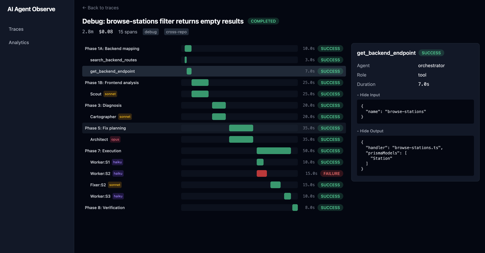
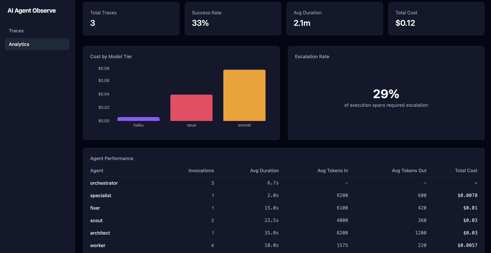

# AI Agent Observer

Observability toolkit for AI agent systems. Traces multi-agent workflows end-to-end, tracking which agents ran, what model tier they used, how many tokens they consumed, what they cost, and where they failed, with one dashboard to trace them all.

Built to solve a real problem: multi-agent orchestrators (like [ai-debugger-orchestrator](https://github.com/gusrodriguez/ai-debug-orchestrator)) are opaque at runtime. When an agent chain fails or costs spike, there's no structured way to see what happened inside. AI Agent Observer brings observability to AI agent workflows.



## How it works

The observer provides two integration paths depending on how your agent system is built:

- **SDK** — for code-driven orchestrators (TypeScript applications, LangChain, custom pipelines). Import the package and call `startSpan` / `end` in your code.
- **MCP server** — for prompt-driven orchestrators (Claude Code, MCP-compatible agent systems). Add to `.mcp.json` and the LLM calls tracing tools directly.

Both push events to the same Redis Stream. An ingestion worker writes them to PostgreSQL. The dashboard reads from Postgres.

```
Code-driven agent (SDK)                  AI Agent Observer
┌─────────────────────┐
│  import { init }    │    XADD     ┌─────────────────┐
│  span.start(...)    │ ──────────> │                 │
│  span.end(...)      │             │   Redis Stream   │
└─────────────────────┘             │                 │
                                    └────────┬────────┘
Prompt-driven agent (MCP)                    │ XREADGROUP
┌─────────────────────┐             ┌────────▼────────┐
│  Claude Code        │    XADD     │ Ingestion Worker │
│  calls trace_start  │ ──────────> └────────┬────────┘
│  calls span_start   │                      │ Prisma
│  calls span_end     │             ┌────────▼────────┐
└─────────────────────┘             │   PostgreSQL     │
                                    └────────┬────────┘
                                             │ reads
                                    ┌────────▼────────┐
                                    │   Dashboard      │
                                    │   :3080          │
                                    └─────────────────┘
```

### Why both?

Agent systems fall into two camps. In **code-driven** systems (LangChain, CrewAI, custom pipelines), you write application code that controls which agents run and the SDK fits naturally. 
In **prompt-driven** systems (Claude Code, OpenAI Assistants), the LLM itself is the orchestrator and there's no application code to import an SDK into. The MCP server exposes tracing as tools the LLM can call. Same pipeline, different entry points.

### Why Redis Streams

For the messaging layer, I evaluated Redis Streams, Kafka, and Azure Service Bus. Redis Streams provides consumer-group semantics, explicit acks, and a lightweight self-hosted deployment. For the expected workload, it offers sufficient throughput with a significantly lower operational footprint than Kafka. Azure Service Bus provides similar capabilities, but it cannot be self-hosted. Redis Streams appears as the most pragmatic option without introducing unnecessary infrastructure.


## What it tracks

| Concept | What it captures |
|---------|-----------------|
| **Traces** | One complete agent run — a debug session, a code review, a generation pipeline |
| **Spans** | One unit of work within a trace — an agent invocation, a tool call, an LLM request |
| **Nesting** | Parent-child relationships between spans — orchestrator spawns Scout, Scout calls search |
| **Model tiers** | Which model ran each span (haiku, sonnet, opus, gpt, etc.) |
| **Token usage** | Input and output token counts per span |
| **Cost** | Dollar cost per span, aggregated per trace |
| **Escalation** | When a cheap agent fails and a more capable one retries (Worker → Fixer → Specialist) |
| **Events** | Discrete happenings within a span — human checkpoints, approvals, escalation decisions |
| **Tool calls** | MCP tools, API calls, function invocations — input, output, success/failure, duration |
| **Status** | Success, failure, skipped, or still running — per span and per trace |

## Dashboard

### Trace detail

The core view. A waterfall visualization shows every span in a trace as a horizontal bar, nested by parent-child depth and positioned on a time axis.

### Trace list

All traces in reverse chronological order.

### Analytics

Aggregate statistics across all traces: total runs, success rate, average duration, and total spend. A cost breakdown chart shows spend by model tier (how much goes to haiku vs. sonnet vs. opus). An agent performance table lists every agent with its invocation count, average duration, average token usage, and total cost.



## Integration: SDK

The SDK is a lightweight TypeScript package for code-driven agent systems.

```typescript
import { initObserver } from '@ai-agent-observer/sdk';

const observer = initObserver({
  redisUrl: process.env.REDIS_URL,
});

// One trace per complete run
const trace = observer.startTrace('Debug: filter bug', {
  tags: ['debug', 'cross-repo'],
});

// Each agent invocation is a span
const span = trace.startSpan('Scout', {
  agent: 'scout',
  modelTier: 'sonnet',
  role: 'analysis',
  input: { bugDescription: '...' },
});

// Spans nest. Child spans get parentSpanId automatically
const search = span.startSpan('search_backend_routes', {
  input: { query: 'browse-stations' },
});
search.end({ status: 'SUCCESS', output: { matchCount: 3 } });

// End with token counts and cost
span.end({
  status: 'SUCCESS',
  tokensIn: 4200,
  tokensOut: 380,
  cost: 0.015,
});

// Record events for checkpoints and escalations
span.addEvent('checkpoint', 'User approved diagnosis');
span.addEvent('escalation', 'Worker failed, escalating to Fixer', {
  fromTier: 'haiku',
  toTier: 'sonnet',
});

trace.end();
await observer.shutdown();
```

### Tool call tracing

`traceTool` automatically traces function calls, capturing inputs, outputs, errors, and execution status in a child span.


```typescript
// Trace MCP tool calls — input/output/errors captured automatically
const routes = await phase1a.traceTool(
  'search_backend_routes',
  { query: 'browse-stations', method: 'GET' },
  () => mcp.searchBackendRoutes({ query: 'browse-stations' }),
);

// If the tool throws, the span is marked FAILURE with the error message,
// and the error re-throws so your orchestrator can handle it
const endpoint = await phase1a.traceTool(
  'get_backend_endpoint',
  { name: 'browse-stations' },
  () => mcp.getBackendEndpoint({ name: 'browse-stations' }),
);
```

### SDK API surface

| Method                                          | Description                                                       |
| ----------------------------------------------- | ----------------------------------------------------------------- |
| `initObserver({ redisUrl })`                    | Create a Redis-backed observer instance                           |
| `observer.startTrace(name, { tags, metadata })` | Start a trace and return its handle                               |
| `trace.startSpan(name, options)`                | Start a root span                                                 |
| `span.startSpan(name, options)`                 | Start a child span                                                |
| `span.traceTool(name, input, fn)`               | Trace a function call, including its result, errors, and duration |
| `span.addEvent(type, message, metadata)`        | Add an event to the span                                          |
| `span.end(results)`                             | End the span with its execution results                           |
| `trace.end(status)`                             | End the trace and calculate its total cost                        |


### Fire-and-forget design

The SDK never blocks the agent:

```
Agent code                     SDK                        Redis Stream
─────────                      ───                        ────────────
span.end({...})  ──>  push to in-memory queue
       <── returns immediately     │
                                   │  every 1.5s
                                   ├──────────────>  XADD (pipeline)
                                   │
               if flush fails:     │
               drop the batch,  <──┘
               keep running
                                                     Ingestion Worker
                                                     ────────────────
                                                     XREADGROUP (batch 100)
                                                            │
                                                            ▼
                                                     PostgreSQL ($transaction)
                                                            │
                                                     XACK (acknowledge)
```

* **Non-blocking instrumentation** — telemetry events are buffered in memory without waiting for network writes.
* **Batched flushing** — buffered events are published to Redis every 1.5 seconds, configurable through `flushIntervalMs`.
* **Bounded buffering** — the queue stores up to 1,000 events, configurable through `maxQueueSize`. When full, it drops the oldest events.
* **Failure isolation** — failed flushes are discarded and never propagate errors to the instrumented agent.
* **At-least-once ingestion** — once events reach Redis, the ingestion worker acknowledges them only after a successful Postgres write. Unacknowledged events can be redelivered after a worker failure.
* **Graceful shutdown** — `observer.shutdown()` attempts to flush buffered events before disconnecting.


```typescript
const observer = initObserver({
  redisUrl: process.env.REDIS_URL,
  flushIntervalMs: 2000,
  maxQueueSize: 5000,
});
```

* **Fail-open observability** — if Redis is unavailable or `REDIS_URL` is not configured, `initObserver` returns a no-op observer. Instrumented code continues to run normally.

## Integration: MCP server

The MCP server exposes the observer as tools for prompt-driven agent systems. Any MCP-compatible client, including Claude Code and custom agents, can use tracing without importing the SDK directly.

### Connecting it to your project

MCP integration requires two steps:

1. Add the MCP server to `.mcp.json`.
2. Reference the tracing protocol from the orchestrator prompt.

Add the observer to your project's `.mcp.json`:

```json
{
  "mcpServers": {
    "observer": {
      "command": "npx",
      "args": ["tsx", "/path/to/ai-agent-observer/packages/mcp/src/index.ts"],
      "env": {
        "REDIS_URL": "redis://localhost:6380"
      }
    }
  }
}
```

No application code, SDK imports, or build integration are required. The observer remains independent of the instrumented project and does not need prior knowledge of its agents or workflow.

The MCP server runs as a subprocess for the duration of the client session, maintains a single Redis connection, and uses the non-blocking, fail-open behavior described above.

### Tools

| Tool          | Input                                                                                   | Returns      | Description            |
| ------------- | --------------------------------------------------------------------------------------- | ------------ | ---------------------- |
| `trace_start` | `name`, `tags?`, `metadata?`                                                            | `traceId`    | Start a trace          |
| `trace_end`   | `traceId`, `status?`                                                                    | confirmation | End a trace            |
| `span_start`  | `name`, `traceId`, `parentSpanId?`, `agent?`, `modelTier?`, `role?`, `phase?`, `input?` | `spanId`     | Start a span           |
| `span_end`    | `spanId`, `status?`, `tokensIn?`, `tokensOut?`, `cost?`, `output?`, `error?`            | confirmation | End a span             |
| `span_event`  | `spanId`, `type`, `message`, `metadata?`                                                | confirmation | Add an event to a span |


### Tracing protocol

The observer includes a reusable tracing protocol at `prompts/tracing-protocol.md`. Rather than embedding tracing instructions throughout the orchestrator prompt, reference the protocol file:

> If the observer MCP tools are available, follow the tracing protocol at
> `<path>/ai-agent-observer/prompts/tracing-protocol.md`.

The protocol defines the common tracing rules: start a trace, wrap agent calls in spans, record checkpoints and escalations, and close the trace when the workflow finishes. This keeps the orchestrator prompt focused on the workflow itself while the protocol defines how that workflow is observed.

## Getting started

### Prerequisites

* Node.js 22+
* Docker

### 1. Clone and install

```bash
git clone <repo-url>
cd ai-agent-observer
cp .env.example .env
npm install
```

### 2. Start the infrastructure

```bash
docker compose up -d --build
```

This starts:

* **PostgreSQL** on port `5433`, used to store traces, spans, and events.
* **Redis** on port `6380`, used to buffer telemetry events.
* **Ingestion worker**, which reads events from Redis and writes them to PostgreSQL.

The ingestion worker starts after PostgreSQL and Redis are healthy and restarts automatically after a failure.

### 3. Initialize the database

```bash
npm run db:generate
npm run db:migrate
npm run db:seed
```

The seed command creates three example traces representing a successful workflow with escalation, a failed workflow, and a workflow still in progress.

### 4. Start the dashboard

```bash
npm run dev
```

Open http://localhost:3080

### 5. Test the pipeline

Send a sample trace through the complete pipeline:

```bash
npm run test:trace
```

The command simulates a multi-agent debugging workflow and sends its traces through Redis, the ingestion worker, and PostgreSQL. Open the dashboard to inspect the resulting span waterfall.

## Production deployment

For production, deploy the dashboard and ingestion worker as separate containers and configure them to use production PostgreSQL and Redis instances through `DATABASE_URL` and `REDIS_URL`.

```bash
# Dashboard
docker build -f docker/Dockerfile -t ai-agent-observer .

# Ingestion worker
docker build -f docker/Dockerfile.ingestion -t ai-agent-observer-ingestion .
```

Configure the dashboard and ingestion worker with production `DATABASE_URL` and `REDIS_URL` values. The ingestion worker is stateless and reconnects automatically after dependency failures.

